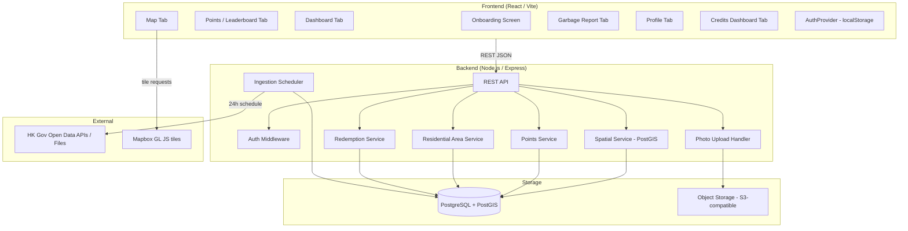

# Design Document: Green Loop App

## Overview

Green Loop is a gamified civic recycling app for Hong Kong residents. Residents earn Points by checking in at recycling Collection Points and reporting misplaced garbage. Points aggregate at the District level to drive a per-area leaderboard across Hong Kong's 18 administrative districts, ranked by Points per km² of district land area. Every recycling action simultaneously awards Individual_Points to the resident and Building_Points to their Residential_Area. Individual_Points are redeemable for Octopus card top-ups via the Credits Dashboard tab.

This is a hackathon prototype. The stack is chosen for speed of development while keeping the architecture clean enough that production concerns (real auth, cloud storage, CI/CD) can be layered in without restructuring.

**Key design decisions:**

- Auth is a thin abstraction over localStorage for the prototype. A single `AuthProvider` interface is the only thing that needs to change to swap in iamSmart OAuth.
- Spatial queries run against PostGIS. The HK government datasets are ingested at startup and on a 24-hour schedule.
- Map rendering uses Mapbox GL JS for 3D building extrusion and WebGL support.
- Photo uploads go directly to object storage (S3-compatible); the API stores only the URL.
- The backend is a Node.js/Express REST API. The frontend is React (Vite) with a mobile-first layout.

---

## Architecture



**Request flow for a Check-In:**
1. Frontend sends `POST /checkins` with `{ residentId, collectionPointId, lat, lng }` and `X-Session-Token` header.
2. Auth middleware validates the session token (prototype: base64 of `displayName:district`).
3. Points Service verifies proximity (≤200 m via PostGIS `ST_Distance`) and 60-minute duplicate window.
4. Points Service awards Individual_Points to the resident and Building_Points to their Residential_Area atomically; applies 1.5× bonus if Premium_Access + Underserved_Area.
5. Response returns awarded individual points, building points, and new total.

---

## Components and Interfaces

### Frontend Components

#### AuthProvider (abstraction layer)

The auth layer is isolated behind a single interface so iamSmart can be plugged in later.

```typescript
interface AuthProvider {
  getSession(): Session | null;
  createSession(displayName: string, district: string): Session;
  clearSession(): void;
  getSessionToken(): string | null; // sent as X-Session-Token header
}

interface Session {
  displayName: string;
  district: string;
  residentId: string; // derived: btoa(`${displayName}:${district}`)
}
```

`LocalStorageAuthProvider` implements this interface for the prototype. A future `IamSmartAuthProvider` would implement the same interface using OAuth tokens.

#### Tab Components

| Tab | Route | Primary API calls |
|-----|-------|-------------------|
| Leaderboard | `/` | `GET /leaderboard` |
| Dashboard | `/dashboard` | `GET /residents/me`, `GET /collection-points/nearby` |
| Map | `/map` | `GET /collection-points/nearby`, `GET /garbage-reports`, `GET /map/stats`, `GET /collection-points/underserved` |
| Garbage Report | `/report` | `POST /garbage-reports` |
| Credits | `/credits` | `GET /residents/me`, `GET /credits/redemptions`, `POST /credits/redeem`, `GET /residential-areas/leaderboard` |
| Profile | `/profile` | `GET /residents/me`, `GET /residents/me/points` |

#### MapView

- Mapbox GL JS instance, 3D pitch enabled when WebGL is available.
- Two marker layers: `collection-points` (blue = basic, green = premium) and `garbage-reports` (red).
- Underserved_Area fill layer rendered from `GET /collection-points/underserved`.
- Live statistics overlay panel updated on viewport change via `GET /map/stats`.
- On marker tap: opens a bottom sheet with detail panel, Check-In button, and Get Directions button.
- On pan/zoom: debounced fetch to `GET /collection-points/nearby` with new map center.
- "Request a Bin" button in map toolbar, visible at all zoom levels.

#### GarbageReportForm

- Captures GPS via `navigator.geolocation.getCurrentPosition`.
- Requires photo attachment (file input, `accept="image/*"`).
- Uploads photo to a pre-signed S3 URL obtained from `POST /upload-url`, then submits the report with the returned URL.

### Backend Services

#### Auth Middleware

```typescript
// Prototype implementation
function authMiddleware(req, res, next) {
  const token = req.headers['x-session-token'];
  if (!token) return res.status(401).json({ error: 'Missing session token' });
  const decoded = Buffer.from(token, 'base64').toString('utf8');
  const [displayName, district] = decoded.split(':');
  if (!displayName || !district) return res.status(401).json({ error: 'Invalid session token' });
  req.resident = { residentId: token, displayName, district };
  next();
}
```

Swapping to iamSmart means replacing this function only — all route handlers use `req.resident` and are unaffected.

#### Points Service

Responsibilities:
- Award Individual_Points for check-ins and garbage reports; simultaneously award equal Building_Points to the resident's Residential_Area in the same atomic transaction.
- Apply 1.5× bonus multiplier for check-ins at Premium_Access Collection_Points located in Underserved_Areas.
- Apply a 10-point deduction to the next Redemption if the resident's balance falls below 50 after a Redemption.
- Enforce 60-minute duplicate check-in window per `(residentId, collectionPointId)`.
- Update district aggregate atomically with the points transaction.
- Return points history ordered by timestamp descending, including both individual_points and building_points per transaction.

#### Spatial Service

Wraps PostGIS queries:
- `findNearby(lat, lng, radiusMetres)` → `ST_DWithin` query, returns distance via `ST_Distance`.
- `pointInDistrict(lat, lng)` → `ST_Contains` against district boundary polygons.
- `findInBoundingBox(minLat, minLng, maxLat, maxLng)` → for garbage report map layer.
- `getUnderservedDistricts()` → computes Collection_Point density per district; flags those below 0.5/km².

#### Ingestion Scheduler

Runs at startup and every 24 hours (configurable via `INGEST_INTERVAL_HOURS` env var):
1. Fetches/downloads each government dataset.
2. Normalizes records per dataset-specific rules.
3. Upserts into PostgreSQL using `ON CONFLICT (source_id) DO UPDATE`.
4. Logs warnings for records with missing required fields; continues processing.
5. Updates `dataset_ingestion_status` table with last-updated timestamp.
6. Recalculates Underserved_Area status for affected districts within 60 seconds of new Collection_Point ingestion.

**District area ingestion note:** District land area (`area_km2`) is derived directly from the GeoJSON boundary polygons using PostGIS `ST_Area(ST_Transform(boundary, 3857)) / 1e6` — no separate area dataset is required. The 2021 Population Census data is ingested for map context and demographic reference only; it is not used in leaderboard scoring.


---

## Data Models

### PostgreSQL Schema

```sql
-- Districts (seeded from government spatial boundary datasets)
CREATE TABLE districts (
  id          SERIAL PRIMARY KEY,
  name        TEXT NOT NULL UNIQUE,           -- e.g. "Yau Tsim Mong"
  code        TEXT NOT NULL UNIQUE,           -- e.g. "YTM"
  area_km2    DOUBLE PRECISION NOT NULL,      -- computed from boundary geometry via ST_Area
  centroid    GEOMETRY(Point, 4326) NOT NULL,
  boundary    GEOMETRY(MultiPolygon, 4326) NOT NULL
);

-- Collection Points
CREATE TABLE collection_points (
  id            SERIAL PRIMARY KEY,
  source_id     TEXT NOT NULL UNIQUE,         -- original dataset identifier
  source        TEXT NOT NULL,                -- 'open_space' | 'recyclable_collection'
  name          TEXT NOT NULL,
  access_tier   TEXT NOT NULL CHECK (access_tier IN ('basic', 'premium')),
  materials     TEXT[] NOT NULL DEFAULT '{}',
  location      GEOMETRY(Point, 4326) NOT NULL,
  district_id   INTEGER REFERENCES districts(id),
  created_at    TIMESTAMPTZ NOT NULL DEFAULT NOW(),
  updated_at    TIMESTAMPTZ NOT NULL DEFAULT NOW()
);
CREATE INDEX idx_cp_location ON collection_points USING GIST (location);

-- Residential Areas (estates or district-level fallback zones)
CREATE TABLE residential_areas (
  id            SERIAL PRIMARY KEY,
  name          TEXT NOT NULL,
  district_id   INTEGER REFERENCES districts(id),
  location      GEOMETRY(Point, 4326),        -- centroid of the area
  created_at    TIMESTAMPTZ NOT NULL DEFAULT NOW()
);

-- Building Points Aggregate (one row per residential area)
CREATE TABLE building_points (
  residential_area_id INTEGER PRIMARY KEY REFERENCES residential_areas(id),
  total_points        BIGINT NOT NULL DEFAULT 0,
  updated_at          TIMESTAMPTZ NOT NULL DEFAULT NOW()
);

-- Residents (created on first API call with a new session token)
CREATE TABLE residents (
  id                   TEXT PRIMARY KEY,             -- base64(displayName:district)
  display_name         TEXT NOT NULL,
  district_id          INTEGER REFERENCES districts(id),
  residential_area_id  INTEGER REFERENCES residential_areas(id),
  total_points         INTEGER NOT NULL DEFAULT 0,
  checkin_count        INTEGER NOT NULL DEFAULT 0,
  report_count         INTEGER NOT NULL DEFAULT 0,
  created_at           TIMESTAMPTZ NOT NULL DEFAULT NOW()
);

-- Points Transactions
CREATE TABLE points_transactions (
  id                   SERIAL PRIMARY KEY,
  resident_id          TEXT NOT NULL REFERENCES residents(id),
  points               INTEGER NOT NULL,           -- individual_points awarded
  building_points      INTEGER NOT NULL DEFAULT 0, -- building_points awarded (mirrors points)
  transaction_type     TEXT NOT NULL CHECK (transaction_type IN ('checkin', 'garbage_report')),
  reference_id         TEXT NOT NULL,              -- collection_point id or garbage_report id
  created_at           TIMESTAMPTZ NOT NULL DEFAULT NOW()
);
CREATE INDEX idx_pt_resident ON points_transactions (resident_id, created_at DESC);

-- District Points Aggregate
CREATE TABLE district_points (
  district_id   INTEGER PRIMARY KEY REFERENCES districts(id),
  total_points  BIGINT NOT NULL DEFAULT 0,
  updated_at    TIMESTAMPTZ NOT NULL DEFAULT NOW()
);

-- Check-In Records (for duplicate detection)
CREATE TABLE checkins (
  id                  SERIAL PRIMARY KEY,
  resident_id         TEXT NOT NULL REFERENCES residents(id),
  collection_point_id INTEGER NOT NULL REFERENCES collection_points(id),
  resident_lat        DOUBLE PRECISION NOT NULL,
  resident_lng        DOUBLE PRECISION NOT NULL,
  points_awarded      INTEGER NOT NULL,
  created_at          TIMESTAMPTZ NOT NULL DEFAULT NOW()
);
CREATE INDEX idx_checkin_dedup ON checkins (resident_id, collection_point_id, created_at DESC);

-- Garbage Reports
CREATE TABLE garbage_reports (
  id            SERIAL PRIMARY KEY,
  resident_id   TEXT NOT NULL REFERENCES residents(id),
  district_id   INTEGER REFERENCES districts(id),
  location      GEOMETRY(Point, 4326) NOT NULL,
  photo_url     TEXT NOT NULL,
  points_awarded INTEGER NOT NULL DEFAULT 15,
  created_at    TIMESTAMPTZ NOT NULL DEFAULT NOW()
);
CREATE INDEX idx_gr_location ON garbage_reports USING GIST (location);

-- Dataset Ingestion Status
CREATE TABLE dataset_ingestion_status (
  dataset_name  TEXT PRIMARY KEY,
  last_ingested TIMESTAMPTZ,
  record_count  INTEGER,
  status        TEXT NOT NULL DEFAULT 'pending'
);

-- Public Housing Estates (for map layer and residential area matching)
CREATE TABLE housing_estates (
  id          SERIAL PRIMARY KEY,
  source_id   TEXT NOT NULL UNIQUE,
  name        TEXT NOT NULL,
  district_id INTEGER REFERENCES districts(id),
  location    GEOMETRY(Point, 4326) NOT NULL
);

-- Bin Requests
CREATE TABLE bin_requests (
  id            SERIAL PRIMARY KEY,
  resident_id   TEXT NOT NULL REFERENCES residents(id),
  district_id   INTEGER REFERENCES districts(id),
  location      GEOMETRY(Point, 4326) NOT NULL,
  description   TEXT,
  created_at    TIMESTAMPTZ NOT NULL DEFAULT NOW()
);

-- Redemptions
CREATE TABLE redemptions (
  id                SERIAL PRIMARY KEY,
  resident_id       TEXT NOT NULL REFERENCES residents(id),
  tier              TEXT NOT NULL,               -- e.g. "50", "100", "200"
  hkd_value         DOUBLE PRECISION NOT NULL,
  points_deducted   INTEGER NOT NULL,
  created_at        TIMESTAMPTZ NOT NULL DEFAULT NOW()
);
CREATE INDEX idx_redemptions_resident ON redemptions (resident_id, created_at DESC);
```


### API Request / Response Shapes

```typescript
// Session (localStorage)
interface Session {
  displayName: string;  // 1–50 chars
  district: string;     // one of 18 HK district names
  residentId: string;   // btoa(`${displayName}:${district}`)
}

// POST /checkins
interface CheckInRequest {
  collectionPointId: number;
  lat: number;
  lng: number;
}
interface CheckInResponse {
  data: {
    pointsAwarded: number;         // individual_points awarded
    buildingPointsAwarded: number; // building_points credited to residential area
    totalPoints: number;
    checkinId: number;
  }
}

// POST /garbage-reports
interface GarbageReportRequest {
  lat: number;
  lng: number;
  photoUrl: string;     // pre-uploaded S3 URL
}
interface GarbageReportResponse {
  data: { reportId: number; pointsAwarded: number; totalPoints: number }
}

// GET /leaderboard
interface LeaderboardEntry {
  rank: number;
  districtName: string;
  totalPoints: number;
  areaKm2: number;
  pointsPerKm2: number;
}

// GET /collection-points/nearby
interface CollectionPointNearby {
  id: number;
  name: string;
  accessTier: 'basic' | 'premium';
  materials: string[];
  lat: number;
  lng: number;
  distanceMetres: number;
}

// GET /map/stats  (bounding box aggregate)
interface MapStatsResponse {
  data: { totalCheckins: number; totalPoints: number; totalGarbageReports: number }
}

// POST /bin-requests
interface BinRequestRequest {
  lat: number;
  lng: number;
  description?: string;
}
interface BinRequestResponse {
  data: { binRequestId: number; createdAt: string }
}

// GET /credits/redemptions
interface RedemptionRecord {
  id: number;
  tier: string;
  hkdValue: number;
  pointsDeducted: number;
  createdAt: string;
}

// POST /credits/redeem
interface RedeemRequest {
  tier: string;   // e.g. "50" | "100" | "200"
}
interface RedeemResponse {
  data: { redemptionId: number; updatedBalance: number; hkdValue: number }
}

// GET /residential-areas/:id/points
interface ResidentialAreaPointsResponse {
  data: {
    residentialAreaId: number;
    name: string;
    totalBuildingPoints: number;
    rankInDistrict: number;
    contributors: Array<{ displayName: string }>;
  }
}

// GET /residential-areas/leaderboard
interface ResidentialAreaLeaderboardEntry {
  rank: number;
  residentialAreaId: number;
  name: string;
  totalBuildingPoints: number;
}

// GET /collection-points/underserved
interface UnderservedAreaEntry {
  districtId: number;
  districtName: string;
  collectionPointDensity: number;   // collection points per km²
  residentialPopulation: number;
}

// Standard error envelope
interface ApiError {
  error: { message: string; field?: string; requestId: string }
}
```


---

## Correctness Properties

*A property is a characteristic or behavior that should hold true across all valid executions of a system — essentially, a formal statement about what the system should do. Properties serve as the bridge between human-readable specifications and machine-verifiable correctness guarantees.*

### Property 1: Display name validation

*For any* string submitted as a display name, the onboarding form validation should accept it if and only if its trimmed length is between 1 and 50 characters inclusive, and a district has been selected.

**Validates: Requirements 1.2, 1.5**

---

### Property 2: Session round-trip

*For any* valid (displayName, district) pair, submitting the onboarding form should result in localStorage containing exactly those values, and reading the session back should return an equivalent Session object.

**Validates: Requirements 1.3, 1.7**

---

### Property 3: Sign-out clears session

*For any* existing session in localStorage, calling `clearSession()` should result in localStorage containing no session data, and `getSession()` returning null.

**Validates: Requirements 1.6, 10.5**

---

### Property 4: Check-in points by tier

*For any* resident and any collection point, the points awarded by a successful check-in should equal exactly 10 if the collection point's access_tier is "basic", and exactly 20 if it is "premium" (before any bonus multiplier).

**Validates: Requirements 2.1, 2.2**

---

### Property 5: Garbage report points

*For any* valid garbage report submission (with photo and coordinates), the points awarded should equal exactly 15.

**Validates: Requirements 2.3**

---

### Property 6: District aggregate consistency

*For any* district, the value of `district_points.total_points` should equal the sum of all `points_transactions.points` for all residents whose `district_id` matches that district.

**Validates: Requirements 2.5, 3.1**

---

### Property 7: Points transaction completeness

*For any* points transaction stored in the database, the record should contain: resident_id, points (individual_points), building_points, transaction_type (one of "checkin" or "garbage_report"), reference_id, and created_at timestamp.

**Validates: Requirements 2.6**

---

### Property 8: Points history ordering

*For any* resident with one or more points transactions, the list returned by `GET /residents/me/points` should be sorted by created_at descending, and the profile tab should show at most the 20 most recent transactions in the same order.

**Validates: Requirements 2.7, 10.3**

---

### Property 9: Duplicate check-in rejection

*For any* resident and collection point, if a successful check-in exists with a created_at timestamp T, then any subsequent check-in attempt for the same (resident, collection point) pair with a timestamp in the range (T, T + 60 minutes) should be rejected with HTTP 409 and award zero points.

**Validates: Requirements 2.8**

---

### Property 10: Leaderboard ordering

*For any* state of district_points, the leaderboard returned by `GET /leaderboard` should be sorted by `points_per_km2` (= total_points / area_km2) in descending order, with no two entries having the same rank.

**Validates: Requirements 3.1, 3.2**

---

### Property 11: Nearby endpoint correctness

*For any* valid (lat, lng, radius) query to `GET /collection-points/nearby`, every returned collection point should satisfy: (a) its distance from (lat, lng) is ≤ radius metres, (b) it contains all required fields (id, name, accessTier, materials, lat, lng, distanceMetres), and (c) the results are sorted by distanceMetres ascending.

**Validates: Requirements 5.4, 9.1, 9.2, 9.3**

---

### Property 12: Tier filter correctness

*For any* tier filter value ("basic" or "premium") passed to `GET /collection-points?tier=`, every returned collection point should have an access_tier matching the filter value.

**Validates: Requirements 9.4**

---

### Property 13: Coordinate validation

*For any* request to a spatial endpoint where lat or lng is missing, non-numeric, or outside the valid range (lat: −90 to 90, lng: −180 to 180), the API should return HTTP 400 with a JSON body identifying the specific invalid field.

**Validates: Requirements 9.6, 11.2**

---

### Property 14: Proximity check-in enforcement

*For any* check-in request where the submitted (lat, lng) is more than 200 metres from the target collection point's coordinates (as computed by PostGIS `ST_Distance`), the API should reject the request with HTTP 422 and award zero points.

**Validates: Requirements 7.3, 7.4**

---

### Property 15: Check-in response completeness

*For any* accepted check-in, the API response should contain pointsAwarded (matching the tier's defined value), buildingPointsAwarded (equal to pointsAwarded), and totalPoints (equal to the resident's previous total plus pointsAwarded).

**Validates: Requirements 7.5**

---

### Property 16: Ingestion normalization

*For any* record ingested from any government dataset, the normalized output should contain all required fields for that dataset type, and the access_tier should be set to "premium" for Open Space Database records and correctly classified for Recyclable Collection Points records. Any record with a missing required field should be rejected and not stored.

**Validates: Requirements 5.8, 8.2, 8.3, 8.4, 8.5, 8.6**

---

### Property 17: Garbage report bounding box

*For any* bounding box query to `GET /garbage-reports`, every returned report should have coordinates that fall within the specified bounding box, and each report should contain coordinates, timestamp, district, and photo thumbnail URL.

**Validates: Requirements 6.5**

---

### Property 18: Garbage report district derivation

*For any* garbage report submitted with (lat, lng) coordinates, the district assigned to the report should be the district whose boundary polygon contains that point (point-in-polygon via PostGIS `ST_Contains`).

**Validates: Requirements 6.9**

---

### Property 19: Garbage report photo requirement

*For any* garbage report submission that does not include a photo, the frontend should reject the submission before sending it to the API, and the API should reject any report request without a photoUrl with HTTP 400.

**Validates: Requirements 6.2, 6.7**

---

### Property 20: API response envelope

*For any* API response, the JSON body should contain either a top-level `data` field (for 2xx responses) or a top-level `error` field (for 4xx/5xx responses), never both, and never neither.

**Validates: Requirements 11.1**

---

### Property 21: Unauthenticated request rejection

*For any* request to an authenticated endpoint that lacks a valid `X-Session-Token` header, the API should return HTTP 401.

**Validates: Requirements 11.3**

---

### Property 22: Request ID uniqueness

*For any* two distinct inbound requests processed by the API, their assigned request identifiers should be different (UUID v4 or equivalent).

**Validates: Requirements 11.5**

---

### Property 23: Resident profile completeness

*For any* resident, the response from `GET /residents/me` should contain: display name, district, total individual_points, total building_points for their residential area, check-in count, garbage report count, and district leaderboard rank.

**Validates: Requirements 10.6**

---

### Property 24: Dual reward atomicity

*For any* successful check-in or garbage report, the individual_points credited to the resident and the building_points credited to the resident's Residential_Area should be equal in value and written in the same database transaction — if either write fails, neither should be committed.

**Validates: Requirements 2.4, 14.1**

---

### Property 25: Bonus multiplier for underserved premium check-ins

*For any* check-in at a Premium_Access Collection_Point located in an Underserved_Area, the individual_points awarded should equal exactly 30 (20 × 1.5), and the building_points awarded should equal the same value.

**Validates: Requirements 2.9**

---

### Property 26: Redemption balance check

*For any* redemption request where the resident's current Individual_Points balance is less than the tier's required points, the API should reject the request with HTTP 422 and return the current balance and required balance; no points should be deducted.

**Validates: Requirements 13.4, 13.5**

---

### Property 27: Bin request storage completeness

*For any* valid bin request submission, the stored record should contain: resident_id, GPS coordinates, district_id, and created_at timestamp; and the API should return a confirmation within 3 seconds.

**Validates: Requirements 12.2, 12.3**

---

### Property 28: Underserved area calculation

*For any* district, the API should flag it as an Underserved_Area if and only if its Collection_Point density (collection points / area_km2) is strictly less than 0.5.

**Validates: Requirements 12.5**

---

### Property 29: Building points aggregate consistency

*For any* Residential_Area, the value of `building_points.total_points` should equal the sum of all `points_transactions.building_points` for all residents whose `residential_area_id` matches that area.

**Validates: Requirements 14.1**

---

### Property 30: Residential area leaderboard ordering

*For any* district, the list returned by `GET /residential-areas/leaderboard?districtId=X` should be sorted by total_building_points descending, with no two entries sharing the same rank.

**Validates: Requirements 14.5**


---

## Error Handling

### Frontend

| Scenario | Behavior |
|----------|----------|
| Geolocation unavailable | Fall back to district centroid; show informational banner |
| Geolocation unavailable at report submission | Block submission; show error: "Location required to submit a report" |
| No photo attached to report | Block submission; show error: "Please attach a photo" |
| API returns 409 (duplicate check-in) | Show: "You already checked in here recently. Try again in X minutes." |
| API returns 422 (too far) | Show: "You're too far from this location to check in." |
| API returns 422 (insufficient balance) | Show current balance and required balance for selected redemption tier |
| API returns 401 | Clear session; redirect to onboarding |
| API returns 400 | Show field-level validation error from response body |
| API returns 500 or network error | Show generic error toast; do not expose internal details |
| Map WebGL unavailable | Fall back to 2D flat map; no error shown to user |

### Backend

| Scenario | HTTP Status | Response |
|----------|-------------|----------|
| Missing/invalid coordinates | 400 | `{ error: { message, field, requestId } }` |
| Missing session token | 401 | `{ error: { message, requestId } }` |
| Duplicate check-in | 409 | `{ error: { message, retryAfterSeconds, requestId } }` |
| Resident too far | 422 | `{ error: { message, distanceMetres, requestId } }` |
| Insufficient redemption balance | 422 | `{ error: { message, currentBalance, requiredBalance, requestId } }` |
| Unhandled exception | 500 | `{ error: { message: "Internal server error", requestId } }` |
| Ingestion record missing field | No HTTP response | Log warning: `{ level: "warn", dataset, field, sourceId }` |

All errors include the `requestId` assigned at request entry. Stack traces are logged server-side only and never returned to the client.

---

## Testing Strategy

### Dual Testing Approach

Both unit tests and property-based tests are required. They are complementary:
- Unit tests catch concrete bugs in specific scenarios and integration points.
- Property-based tests verify universal correctness across the full input space.

### Property-Based Testing

**Library choices:**
- Backend (Node.js): `fast-check`
- Frontend (React): `fast-check` with React Testing Library

**Configuration:** Each property test must run a minimum of 100 iterations.

**Tag format:** Each property test must include a comment:
```
// Feature: green-loop-app, Property N: <property_text>
```

Each correctness property above must be implemented by exactly one property-based test.

**Example (Property 4):**
```typescript
// Feature: green-loop-app, Property 4: Check-in points by tier
it('awards correct points based on access tier', () => {
  fc.assert(
    fc.property(
      fc.constantFrom('basic', 'premium'),
      (tier) => {
        const result = calculateCheckInPoints(tier);
        return tier === 'basic' ? result === 10 : result === 20;
      }
    ),
    { numRuns: 100 }
  );
});
```

### Unit Tests

Focus on:
- Specific examples: onboarding happy path, sign-out flow, check-in confirmation UI
- Integration points: API client ↔ auth middleware, spatial service ↔ PostGIS
- Edge cases: empty radius results (200 + empty array), radius cap at 10,000 m, WebGL fallback
- Error conditions: 401 redirect, 409 retry message, 422 distance message, 422 insufficient balance

Avoid writing unit tests that duplicate what property tests already cover (e.g. don't write 10 unit tests for different display name lengths when Property 1 covers all lengths).

### Test Coverage Targets

| Layer | Unit | Property |
|-------|------|----------|
| Auth / session logic | ✓ | Properties 1–3 |
| Points service | ✓ | Properties 4–9, 24–25 |
| Leaderboard | ✓ | Property 10 |
| Spatial service | ✓ | Properties 11–14, 17–18, 28 |
| Ingestion normalizer | ✓ | Property 16 |
| API response envelope | ✓ | Properties 20–22 |
| Frontend validation | ✓ | Properties 1, 19 |
| Profile / history | ✓ | Properties 8, 23 |
| Check-in response | ✓ | Property 15 |
| Bin requests | ✓ | Property 27 |
| Redemption service | ✓ | Property 26 |
| Building points / residential areas | ✓ | Properties 29–30 |
